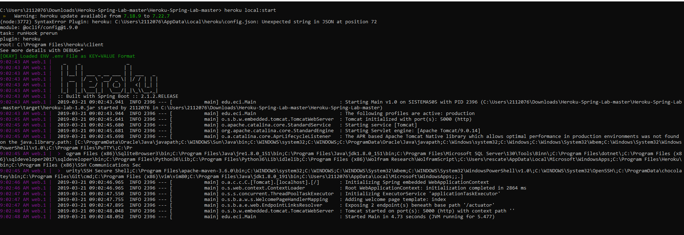
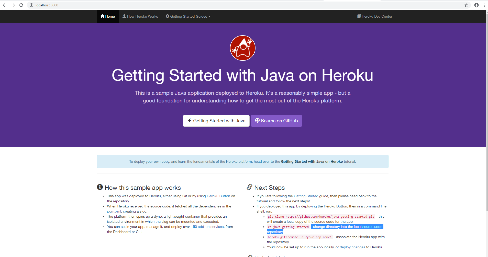
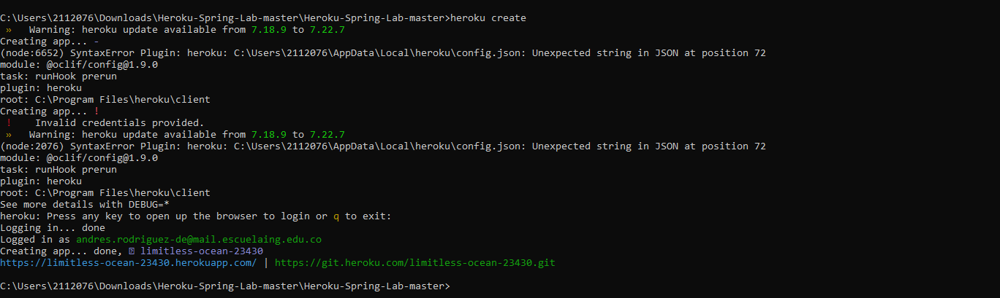
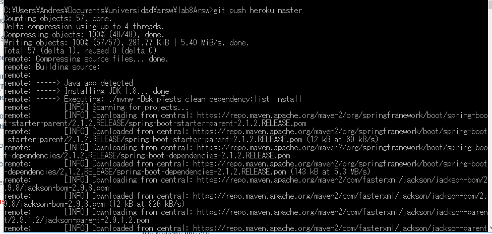
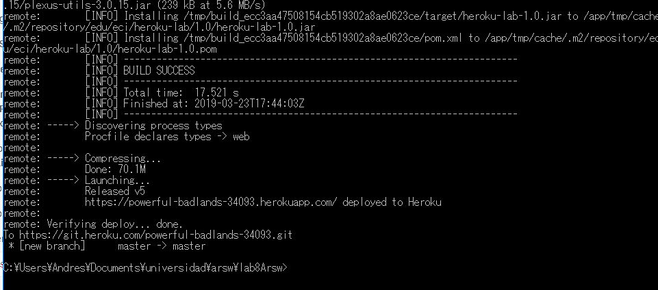
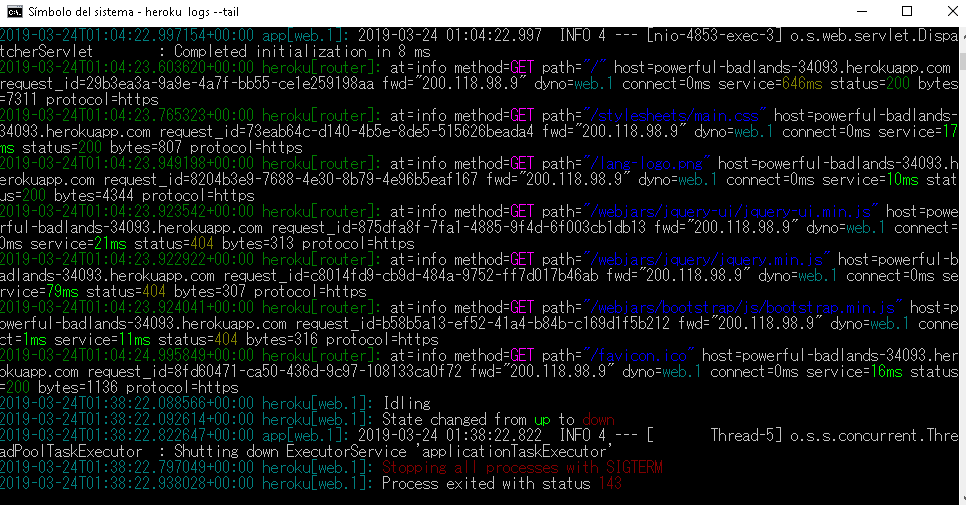
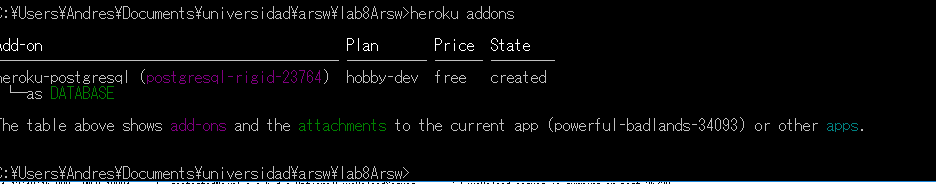
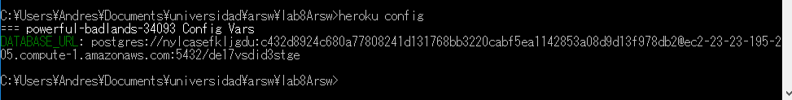

# java-getting-started
# Heroku
What the application do?
You can see a tutorial on how to create and use heroku, and connect it to a postgresql database
Describe the REST services exposed by the application.
* Add a new user
* Get a specific user
* Delete a specific user
* Update a specific user

For what purpose is the Procfile plaintext file?

Heroku apps include a Procfile that specifies the commands that are executed by the app on startup. You can use a Procfile to declare a variety of process types, including:
* Your app’s web server
* Multiple types of worker processes
* A singleton process, such as a clock
* Tasks to run before a new release is deployed

heroku create

git push heroku master

heroku ps:scale web=1

heroku open

heroku logs --tail

# Data base
heroku addons

heroku config

heroku pg

